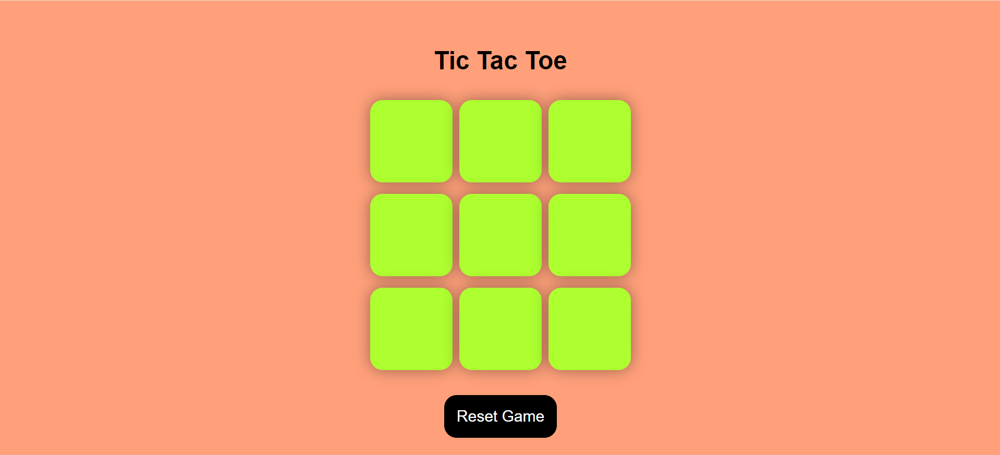

# Tic Tac Toe Game

A classic Tic Tac Toe game implemented using HTML, CSS, and JavaScript. Playable in any modern web browser, this game features a 3x3 grid where two players can take turns marking X and O, aiming to get three of their symbols in a row to win.

## Features

- **Two Player Mode**: Play against another human player.
- **Win Detection**: Automatically detects when a player wins or the game ends in a draw.
- **Responsive Design**: The game board adjusts to different screen sizes.
- **Reset Functionality**: Easily restart the game with a single button click.

## Table of Contents

- [Installation](#installation)
- [Usage](#usage)
- [Game Rules](#game-rules)
- [Technologies Used](#technologies-used)
- [Example](#example)
- [Contributing](#contributing)
- [License](#license)

## Installation

1. **Clone the Repository**
   git clone https://github.com/adiraj7280/TIC-TAC-TOE.git

2. **Navigate to the Project Directory**
   cd Tic-Tac-Toe

3. **Open the `index.html` File**
   Open `index.html` in your favorite web browser to start playing the game.

## Usage

1.**Starting the Game:** Open the `index.html` file in a web browser. The game board will be displayed.

2.**Playing the Game:** -Click on an empty cell to place your symbol (X or O).
                        Players alternate turns, starting with X.
                        The game will automatically detect if a player wins or if the game ends in a draw.

3.**Resetting the Game:**-Click the "Reset Game" button to clear the board and start a new game.

## Game Rules

-The game is played on a 3x3 grid.

-Players take turns placing their symbols (X and O) in empty cells.

-The first player to get three of their symbols in a row (horizontally, vertically, or diagonally) wins the game.

-If all cells are filled without a winner, the game ends in a draw.

## Technologies Used

-**HTML:** For the structure of the game board.

-**CSS:** For styling and layout of the game board and cells.

-**JavaScript:** For game logic, handling user interactions, and determining win conditions.

## Example

Here’s a basic example of how the game looks:

## Contributing

If you want to contribute to this project, follow these steps:

-**Fork the Repository:** Create a copy of the repository under your GitHub account.

-**Create a Branch:** Develop your changes on a separate branch.

-**Commit Your Changes:** Write clear, concise commit messages.

-**Submit a Pull Request:** Provide a description of the changes you’ve made.

Feel free to report issues or suggest improvements by opening an issue on the GitHub repository.

## Licence

This project is licensed under the MIT License. See the [LICENSE](LICENSE) file for details.

